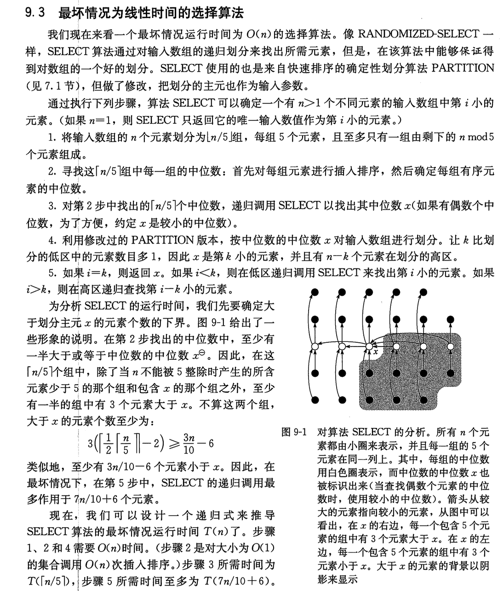
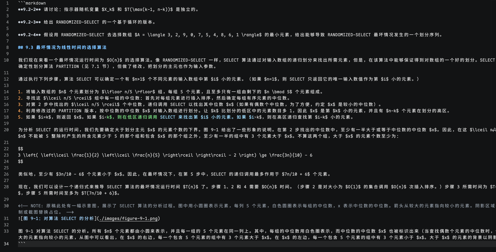

<picture>
  <source media="(prefers-color-scheme: dark)" srcset="https://img.shields.io/badge/Shot2MD-Screenshot%20to%20Markdown-58a6ff?style=for-the-badge&logo=markdown&logoColor=white&labelColor=0d1117">
  <source media="(prefers-color-scheme: light)" srcset="https://img.shields.io/badge/Shot2MD-Screenshot%20to%20Markdown-0366d6?style=for-the-badge&logo=markdown&logoColor=white&labelColor=ffffff">
  
</picture>

<div align="center">

<br />

```
𝚂𝚗𝚊𝚙. 𝚁𝚎𝚌𝚘𝚐𝚗𝚒𝚣𝚎. 𝙿𝚊𝚜𝚝𝚎.
```

macOS 截图 → AI 视觉识别 → Markdown 自动复制到剪贴板

<br />

[](https://github.com)
[](https://python.org)
[](LICENSE)

</div>


---

## ✦ 效果展示

<table>
<tr>
<td align="center" width="50%">

**输入：教材截图**



</td>
<td align="center" width="50%">

**输出：Markdown 文本**



</td>
</tr>
</table>

> 📸 截图 → 📝 带格式的 Markdown，数学公式自动转 LaTeX，一键粘贴。

---

## ✦ 工作流程

<div align="center">

```
╭──────────────────────────────────────────────╮
│                                              │
│   ⌘ ⌥ ⇧ 4      截图到剪贴板                │
│       │                                      │
│       ▼                                      │
│   Shot2MD     监听剪贴板，检测到新图片        │
│       │                                      │
│       ▼                                      │
│   AI Vision   调用视觉模型高精度识别           │
│       │                                      │
│       ▼                                      │
│   Clipboard   Markdown 自动复制到剪贴板      │
│       │                                      │
│       ▼                                      │
│   ⌘ V         直接粘贴，得到格式化文本        │
│                                              │
╰──────────────────────────────────────────────╯
```

</div>

---

## ✦ 功能

<table>
<tr>
<td width="50%">

#### 📸 零操作触发
用系统自带 `Cmd+Option+Shift+4` 截图，Shot2MD 自动检测并识别，无需任何额外操作。

</td>
<td width="50%">

#### 🤖 多模型支持
兼容所有 OpenAI 格式 API。

</td>
</tr>
<tr>
<td>

#### 🔒 安全存储
API Key 存储于 macOS Keychain，不写入任何文件。

</td>
<td>

#### ✏️ 自定义提示词
编辑 `prompt.md` 即可自由控制输出格式、语言、精度等行为。

</td>
</tr>
<tr>
<td>

#### 🧮 LaTeX 公式
数学公式自动转为 `$...$` / `$$...$$` 格式，表格自动转 GFM 语法。

</td>
<td>

#### 📋 即贴即用
识别完成自动复制，`Cmd+V` 直接粘贴到任何编辑器或 AI 对话框。

</td>
</tr>
</table>

---

## ✦ 安装

```bash
# 1. 安装 Python 3.9（含 tkinter GUI 支持）
brew install python-tk@3.9

# 2. 安装依赖
/opt/homebrew/opt/python@3.9/bin/pip3.9 install pillow pyperclip openai

# 3. 克隆项目
git clone https://github.com/SakuyaInazaki/Shot2MD.git
cd shot2md
```

---

## ✦ 使用

启动程序：

```bash
./start.sh
```

首次使用时点击 **⚙️ 设置**，填入 API 地址、API Key 和模型名称。

之后每次使用只需：

| 步骤 | 操作 |
|:----:|------|
| 1 | 按 `Cmd+Option+Shift+4` 选择区域截图 |
| 2 | 等待 macOS 通知「已复制到剪贴板」 |
| 3 | `Cmd+V` 粘贴 Markdown 文本 |

> 程序启动后会在后台持续监听剪贴板。截图 → 识别 → 复制，全自动完成。

---

## ✦ 自定义提示词

项目目录下的 `prompt.md` 控制 AI 的识别行为。默认提示词侧重高精度逐字转录，支持：

- 手写稿、印刷文档、PPT 截图
- 数学公式 → LaTeX
- 表格 → GFM
- 流程图 → Mermaid
- 代码块自动识别语言

可根据自己的需求自由修改。

---

## ✦ 系统要求

| 依赖 | 安装方式 |
|------|----------|
| macOS | 系统截图 + Keychain 安全存储 |
| Python 3.9 + tkinter | `brew install python-tk@3.9` |
| 支持 Vision 的 AI API | 推荐使用Gemini 2.5pro |

---

<div align="center">

**Shot2MD** — 截图即文字

[MIT License](LICENSE)

</div>
